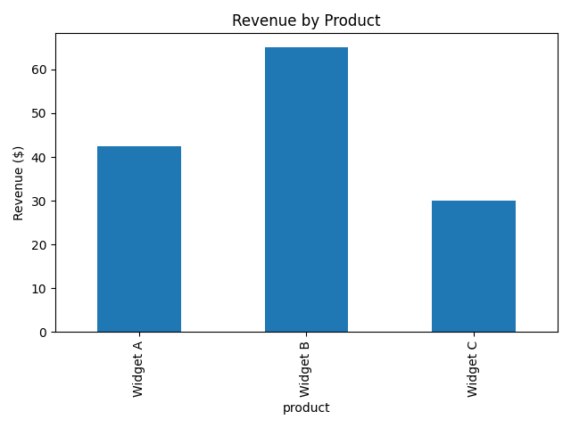

# 📊 Sales Summary with SQLite and Python

This project demonstrates how to use **SQLite**, **SQL**, and **Python** to perform basic sales data analysis and visualize the results using a bar chart.

## 🧰 Tools & Libraries Used

- `sqlite3` – manage SQLite database
- `pandas` – data manipulation
- `matplotlib` – data visualization
- `Jupyter Notebook` – code execution and output

---

## 💾 Dataset

A small SQLite database created in-memory with a single table called `sales`.  
The structure of the table is:

| Column   | Type    | Description              |
|----------|---------|--------------------------|
| id       | INTEGER | Primary key              |
| product  | TEXT    | Name of the product      |
| quantity | INTEGER | Number of units sold     |
| price    | REAL    | Price per unit           |

Sample data is inserted through Python code.

---

## 📈 SQL Query Used

```sql
SELECT 
    product, 
    SUM(quantity) AS total_qty, 
    SUM(quantity * price) AS revenue 
FROM sales 
GROUP BY product;
````

## 📎 File
- 📘 [SQL Script: SQLite_Database.sql](./SQLite%20Database%20.ipynb)— The notebook containing all the code and outputs

| 📌 |  — The revenue chart image

## ✅ Outcome
By completing this project, you:

Learned how to run SQL queries inside Python

Performed simple data aggregation

Created your first product revenue visualization


